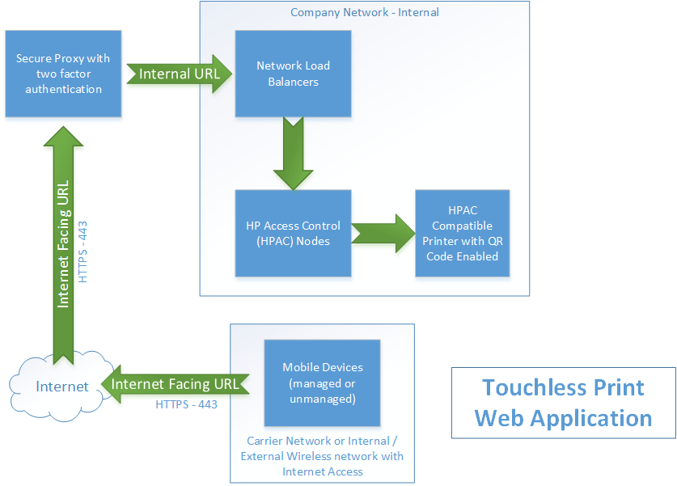

Overview and Context
====================

Printing can be done a multitude of ways in various environments. One of
these methods involves the use of a licensed product called HP Access
Control (HPAC), which allows a user to print their jobs to a "common"
print queue. Print jobs are then released at a particular printer by
swiping a proximity badge assigned to the user. However, this requires
several interactions by the user with the printer control panel to
release the user's jobs. The challenge is to reduce interaction with the
physical print device by eliminating the screen as a contact surface.

This paper presents a solution to create a simple, easy-to-use,
touchless mobile web application that can release print jobs at a
printer by scanning a QR code assigned to that printer, viewing a list
of print jobs ready to print on the user's mobile device, and then
selecting the print job for printing without touching the printer
control surface.

This document provides guidance for implementing the Touchless Print
mobile application for your own purposes. We at General Motors think
this capability benefits all of us and are happy to provide this as an
open source effort in hopes that it will not only be used, but that it
will be improved upon by others in the community.

Capabilities
============

The Open Source Touchless Print (TLP) mobile app provides the following
capabilities:

-   An Angular-based web application that integrates with an existing
    HPAC infrastructure.

-   Responsive and modern mobile interface for browsing and releasing
    print jobs with no touching of printer control panels required.

-   QR Code® scanner that reads codes generated by HPAC managed
    printers - displayed on the touch screen or sticker on the device.

-   Ability to browse and release prints regardless of whether or not
    the mobile phone is being managed by corporate software.

-   Network agnostic -- works on any carrier or wireless network with
    internet access.

Architecture
============

The following is a visualization of how the TLP app integrates with HPAC
at an architectural level.

Open Source Software
====================

The following open source TLP software and assets are used in this
application:

-   https://github.com/generalmotors/touchless-print-mobile-app

Prerequisites
=============

-   An existing HP Access Control installation (single or multiple
    servers)

-   Printers (typically HP multi-function devices) managed by HPAC with
    FutureSmart firmware

-   An internet facing URL and secure incoming access (ex. 2FA) to the
    HPAC system

-   For Android mobile devices: Chrome

-   For IOS mobile devices: Safari

-   The open source Touchless Print web app as listed above

Implementation
==============

HPAC ships with the ability to release print jobs from a built-in secure
Pull Print web page. This feature is available up to at least version
16.8 and, assuming defaults, can be accessed via:

**http://\<your HPAC internal DNS name\>/mydoc** *(referred to as
"**mydoc**" within this document).*

The HP Access Control Administrator Guide contains details on this
feature and should be reviewed and the feature tested prior to
implementing Touchless Print. This TLP software leverages mydoc's
ability to release HPAC print jobs and adds QR code scanning, a
responsive mobile interface, custom logging, and requires no additional
licensing or mobile app purchases.

Installation
------------

The following configurations must be made on any HPAC server that will
be hosting Touchless Print. It is assumed that the web files specific to
Touchless Print have already been edited for relative
company/infrastructure settings.

-   Angular Project Setup

    -   Clone the repository

    -   Perform an *'npm install'* to gather all the necessary packages

    -   Modify the configuration JSON files for each of your
        environments (assets/config)

    -   Compile the Angular project

        -   npm run build:\<environment\>

            -   Current environments for builds are *stage* and *prod*

            -   Development configuration will be used for running
                locally

-   Mydoc Page Customization (additional details in GitHub repository)

    -   In order to handle information passed by the Angular
        application, the below customizations to the *mydoc* page are
        required

        -   Getting a query string from the URL (generic)

            -   This function can grab the '*ip'* query string key
                passed from the angular application after a QR code is
                scanned

        -   Injecting that IP into the given *'ip'* input box

    -   Steps to increase usability *(optional)*

        -   Modifying style to fit the app theme

        -   Adding a custom back button to return to the Angular
            application

        -   Deleting print jobs after printing by default or not

        -   Hiding inputs no longer needed due to automation

            -   Reduces potential for human errors

        -   Modifying print button flow to add additional logging to IIS
            for number of documents printed and button clicks

-   Web Files:

    -   Copy the compiled Angular application and the modified mydoc
        page to \<HPAC Install Directory\>\\DPR

> (i.e. C:\\Program Files\\HP\\HP Access Control\\DPR)

-   Default Document:

    -   Go to IIS\>local server name\>Sites\>Default Web
        Site\>MyDoc\>Default document.

    -   Add HPAC Install Directory\\DPR\\Print.html as a default
        document.

-   Proxy Passthrough:

> There are numerous technologies for allowing incoming traffic to the
> HPAC servers. The appropriate configuration should be implemented to
> support your business and security needs. If using Microsoft
> technologies, this article is informational -
> <https://docs.microsoft.com/en-us/azure/active-directory/manage-apps/application-proxy-back-end-kerberos-constrained-delegation-how-to>.
>
> When configuring access for TLP, these are important items to
> consider:

-   Access from any network (internet facing) or limited to just the
    company network

-   Two factor authentication (2FA)

-   Handling of credentials when authenticating to HPAC

The following configurations are made within the HPAC Console on the
administration node for HPAC. If your environment uses multiple HPAC
Load Balancer Profiles, the settings must be applied to each profile
that is hosting Touchless Print.

-   QR Code:

    -   Log into the HPAC console and enable the QR Code checkbox in the
        Pull Printing options.

    -   Re-deploy workflows to the printer fleet.

Verification
------------

Because multiple IIS virtual directories leverage the DPR folder,
verifying end-to-end functionality for traditional badge print as well
as touchless print is recommended. Opening various configuration
settings in IIS (Logging, HTTP Redirect, etc.) for the DPR directory can
reveal conflicts, if any, in the web.config file.

Credits
=======

This Touchless Print solution represents the hard work of some very
passionate and innovative people at General Motors. Specifically:

-   Alex Maro

-   Andy Jartz

-   Brian Hartley

-   Daniel Schleuger

-   Mitch Jeric

-   Peter Linton

-   Rick De Bucce

-   Shane McCutchen

License
=======

The software described in this paper is offered under the MIT License
and is available at
<https://github.com/generalmotors/touchless-print-mobile-app>

This documentation is licensed under a Creative Commons
Attribution-NoDerivatives 4.0 International License.

Attribution: Copyright 2020 General Motors LLC

QR Code is a registered trademark of DENSO WAVE INCORPORATED.
